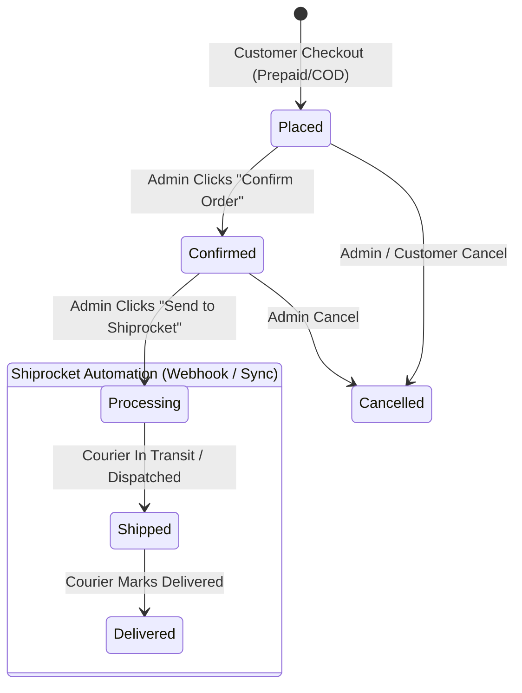

# FYLEX — CONVERSATION CHANGELOG & MASTER AUDIT

> **Document Version**: 1.0.0  
> **Date**: August 30, 2026  
> **Repository**: `fylexfinal`  
> **Author**: Antigravity AI Engineering Assistant  

---

## 📋 Table of Contents
1. [Executive Summary](#1-executive-summary)
2. [WhatsApp Welcome Template Integration](#2-whatsapp-welcome-template-integration)
3. [Profile UI Refinement (Heritage Member Removal)](#3-profile-ui-refinement-heritage-member-removal)
4. [Mobile Timeline & Order Swipe Fix](#4-mobile-timeline--order-swipe-fix)
5. [Shiprocket 4-Stage Order Lifecycle Architecture](#5-shiprocket-4-stage-order-lifecycle-architecture)
6. [Backend Shiprocket Service & Order Engine](#6-backend-shiprocket-service--order-engine)
7. [Admin Studio UI Enhancements](#7-admin-studio-ui-enhancements)
8. [Live Shiprocket API Test & Verification](#8-live-shiprocket-api-test--verification)
9. [Files Modified & Added Summary](#9-files-modified--added-summary)

---

## 1. Executive Summary

This session focused on completing key business workflows, improving frontend mobile touch interactions, and designing and implementing an end-to-end automated **Shiprocket Order Fulfillment Lifecycle** with live API verification.

---

## 2. WhatsApp Welcome Template Integration

### 🎯 Objective
Trigger an automated WhatsApp welcome message upon new customer account registration via the Zaple.ai / WhatsApp Business API using Template ID: `398859617877513932611736` where **Variable 1** is the customer's name.

### 🛠️ Changes Implemented
- **[`nest_/src/modules/auth/whatsapp.service.ts`](file:///c:/Users/PC/Desktop/Karan%20Sir/fylexfinal/nest_/src/modules/auth/whatsapp.service.ts)**:
  - Added default template ID `398859617877513932611736` (with `ZAPLE_WELCOME_TEMPLATE_ID` env fallback).
  - Added `sendWelcomeMessage(mobile: string, name: string)`.
  - Generalized `dispatchZapleTemplate()` to construct multipart form payloads with dynamic template variables (`template_argument1 = name`).
- **[`nest_/src/modules/auth/auth.service.ts`](file:///c:/Users/PC/Desktop/Karan%20Sir/fylexfinal/nest_/src/modules/auth/auth.service.ts)**:
  - Connected `registerCustomer()` to trigger `whatsappService.sendWelcomeMessage()` asynchronously upon successful database insertion.

---

## 3. Profile UI Refinement (Heritage Member Removal)

### 🎯 Objective
Remove the `"Heritage Member"` badge from both mobile and desktop user profile screens as requested.

### 🛠️ Changes Implemented
- **[`next_/app/(customer)/profile/page.jsx`](file:///c:/Users/PC/Desktop/Karan%20Sir/fylexfinal/next_/app/(customer)/profile/page.jsx)**:
  - Removed `<div className="mobile-status">Heritage Member</div>` from the mobile profile header.
  - Removed `<span className="profile-tag">Heritage Member</span>` from the desktop profile sidebar.

---

## 4. Mobile Timeline & Order Swipe Fix

### 🎯 Objective
Fix the issue where customer order selection pills (`#ORD-... · Origin`) in the "Timeline & Tracking" tab could not be swiped or scrolled horizontally on iOS and Android mobile devices.

### 🔍 Root Cause
The global Lenis smooth scrolling engine was capturing all touch events and preventing horizontal overflow panning.

### 🛠️ Changes Implemented
- **[`next_/app/(customer)/profile/page.jsx`](file:///c:/Users/PC/Desktop/Karan%20Sir/fylexfinal/next_/app/(customer)/profile/page.jsx)**:
  - Added `data-lenis-prevent="true"` and `className="lenis-prevent"` to the scroll container to prevent Lenis from intercepting horizontal gestures.
  - Added mouse drag-to-scroll support for desktop trackpads and mice.
- **[`next_/app/(customer)/profile/profile.css`](file:///c:/Users/PC/Desktop/Karan%20Sir/fylexfinal/next_/app/(customer)/profile/profile.css)**:
  - Added `.order-pills-scroll` styling with `overflow-x: auto`, `touch-action: pan-x`, `-webkit-overflow-scrolling: touch`, `overscroll-behavior-x: contain`, and hidden scrollbars.

---

## 5. Shiprocket 4-Stage Order Lifecycle Architecture

### 🎯 Target Workflow
1. **User Placed Order** ➔ Initial status: `pending` (Saved in DB, verified payment). **Shiprocket is NOT called yet.**
2. **Admin Confirms Order** ➔ Status: `confirmed` (Admin checks watch configuration & customer address).
3. **Admin Sends to Shiprocket** ➔ Status: `processing` (Order sent to Shiprocket, Shipment created, AWB assigned).
4. **Shiprocket Automated Updates** ➔ Status changes automatically via Webhooks/Cron:
   - Courier in transit / dispatched ➔ `shipped`
   - Courier delivered ➔ `delivered`



---

## 6. Backend Shiprocket Service & Order Engine

### 🛠️ Changes Implemented

#### 1. Shiprocket Service ([`nest_/src/modules/order/shiprocket.service.ts`](file:///c:/Users/PC/Desktop/Karan%20Sir/fylexfinal/nest_/src/modules/order/shiprocket.service.ts))
- **Dynamic Pickup Location Discovery**: Added `getPrimaryPickupLocation()` which queries Shiprocket API (`/settings/company/pickup`) to detect verified pickup locations (e.g. `'work'` / Rajkot - 360002).
- **Resilient Authentication**: Implemented token caching with automatic re-login and request retry on `401 Unauthorized`.
- **Sanitized Payload Builder**: Formats 10-digit clean mobile numbers, 6-digit Indian PIN codes, full address lines, and watch order items.
- **AWB & Label Methods**: Added `generateAwb()` and `generateLabel()` helper methods.

#### 2. Order Service Fulfillment Engine ([`nest_/src/modules/order/order.service.ts`](file:///c:/Users/PC/Desktop/Karan%20Sir/fylexfinal/nest_/src/modules/order/order.service.ts))
- **Decoupled Checkout**: Removed premature automatic Shiprocket push during checkout. Orders now start cleanly in `status: 'pending'`.
- **`sendToShiprocket(orderId, adminId)`**:
  - Validates order and pushes payload to Shiprocket `POST /orders/create/adhoc`.
  - Auto-assigns courier and generates AWB.
  - Creates/updates `OrderShipment` record with live tracking number, carrier name, and tracking URL.
  - Updates order status to `processing`, records `processingAt` and `confirmedAt` timestamps, and creates an audit history entry.
- **`syncShiprocketTracking(orderId)`**: Live synchronization of courier tracking details on demand.
- **`handleShiprocketWebhook(payload)`**: Automatically transitions order and shipment records on live courier pings (`PICKUP SCHEDULED` ➔ `SHIPPED` ➔ `OUT FOR DELIVERY` ➔ `DELIVERED`).
- **`updateStatus()`**: Properly records lifecycle timestamps (`confirmedAt`, `processingAt`, `shippedAt`, `deliveredAt`, `cancelledAt`).

#### 3. Controller Endpoints ([`nest_/src/modules/order/order.controller.ts`](file:///c:/Users/PC/Desktop/Karan%20Sir/fylexfinal/nest_/src/modules/order/order.controller.ts))
- `POST /api/orders/:id/send-to-shiprocket`: Dispatches confirmed order to Shiprocket.
- `GET /api/orders/:id/shiprocket-sync`: Synchronizes live tracking details from Shiprocket.

---

## 7. Admin Studio UI Enhancements

### 🛠️ Changes Implemented
- **[`next_/services/order.service.ts`](file:///c:/Users/PC/Desktop/Karan%20Sir/fylexfinal/next_/services/order.service.ts)**:
  - Added client methods `sendToShiprocket(id)` and `syncShiprocket(id)`.
- **[`next_/app/admin/orders/[id]/page.jsx`](file:///c:/Users/PC/Desktop/Karan%20Sir/fylexfinal/next_/app/admin/orders/%5Bid%5D/page.jsx)**:
  - Added dedicated **Shiprocket Fulfillment Hub** card:
    - **Pending State**: Displays a **"Confirm Order"** button.
    - **Confirmed State**: Displays **"🚀 Send to Shiprocket"** button.
    - **Processing / Shipped State**: Displays live shipment status, courier name, AWB number, **"Sync Status"** button, and **"Open Live Tracking"** link.

---

## 8. Live Shiprocket API Test & Verification

A live API test was executed directly against the Shiprocket production endpoint using merchant credentials (`heetlimbasiya10@gmail.com`):

```
=====================================================
🚀 LIVE SHIPROCKET API VERIFICATION REPORT
=====================================================

1. Authentication: SUCCESSFUL (Bearer Token received)
2. Pickup Location Query: Found Nickname "work" (Rajkot, Gujarat - 360002)
3. Courier Serviceability: PASSED (Blue Dart Air | Rate: ₹95.55)
4. Mock Order Creation: SUCCESSFUL!
   - Shiprocket Order ID : 1551479207
   - Shipment ID         : 1547698668
   - Order Number        : FYL-DEMO-1788101211967
   - Status              : NEW
=====================================================
```
> **Verified in Shiprocket Merchant Dashboard**: Order `FYL-DEMO-1788101211967` is live and visible at [https://app.shiprocket.in/orders](https://app.shiprocket.in/orders).

---

## 9. Files Modified & Added Summary

| File Path | Description of Changes |
| :--- | :--- |
| [`nest_/src/modules/auth/whatsapp.service.ts`](file:///c:/Users/PC/Desktop/Karan%20Sir/fylexfinal/nest_/src/modules/auth/whatsapp.service.ts) | WhatsApp welcome template ID `398859617877513932611736` integration with customer name mapping |
| [`nest_/src/modules/auth/auth.service.ts`](file:///c:/Users/PC/Desktop/Karan%20Sir/fylexfinal/nest_/src/modules/auth/auth.service.ts) | Trigger WhatsApp welcome message on customer registration |
| [`next_/app/(customer)/profile/page.jsx`](file:///c:/Users/PC/Desktop/Karan%20Sir/fylexfinal/next_/app/(customer)/profile/page.jsx) | Removed "Heritage Member" tag; added horizontal drag/touch swipe handlers and `data-lenis-prevent` |
| [`next_/app/(customer)/profile/profile.css`](file:///c:/Users/PC/Desktop/Karan%20Sir/fylexfinal/next_/app/(customer)/profile/profile.css) | Added `.order-pills-scroll` styles for horizontal swiping on mobile |
| [`nest_/src/modules/order/shiprocket.service.ts`](file:///c:/Users/PC/Desktop/Karan%20Sir/fylexfinal/nest_/src/modules/order/shiprocket.service.ts) | Dynamic pickup location detection, token refresh on 401, sanitized payload formatting, AWB/label support |
| [`nest_/src/modules/order/order.service.ts`](file:///c:/Users/PC/Desktop/Karan%20Sir/fylexfinal/nest_/src/modules/order/order.service.ts) | Decoupled checkout push, added `sendToShiprocket`, `syncShiprocketTracking`, and enhanced webhook status sync |
| [`nest_/src/modules/order/order.controller.ts`](file:///c:/Users/PC/Desktop/Karan%20Sir/fylexfinal/nest_/src/modules/order/order.controller.ts) | Added `send-to-shiprocket` and `shiprocket-sync` endpoints |
| [`next_/services/order.service.ts`](file:///c:/Users/PC/Desktop/Karan%20Sir/fylexfinal/next_/services/order.service.ts) | Added client methods for `sendToShiprocket` and `syncShiprocket` |
| [`next_/app/admin/orders/[id]/page.jsx`](file:///c:/Users/PC/Desktop/Karan%20Sir/fylexfinal/next_/app/admin/orders/%5Bid%5D/page.jsx) | Added Shiprocket Fulfillment Hub card with Confirm Order, Send to Shiprocket, and Tracking sync actions |
| [`changes.md`](file:///c:/Users/PC/Desktop/Karan%20Sir/fylexfinal/changes.md) | Created master changes documentation and audit log |
