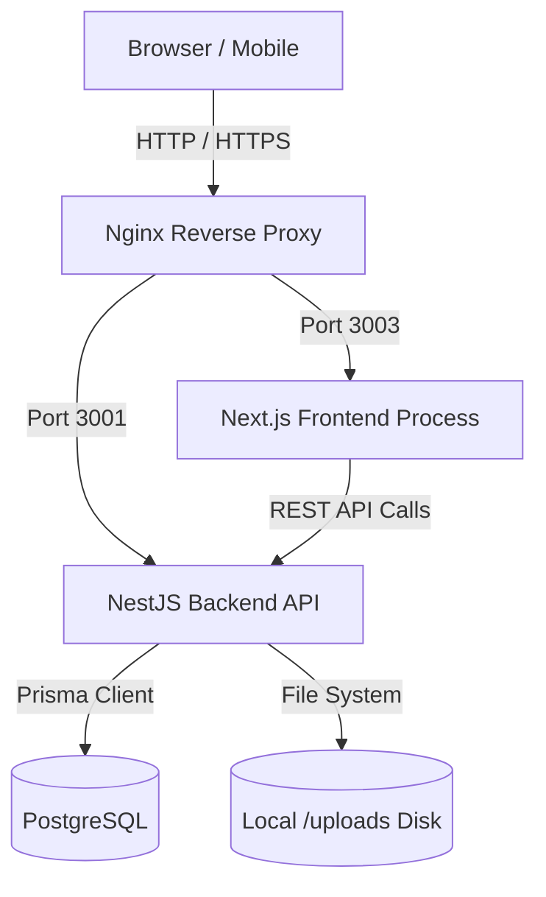

# Architecture Report

## 1. High-Level Architecture
The FYLEX platform is built on a modern decoupled architecture:
- **Frontend (Client-Facing):** A React-based SPA built within the Next.js App Router framework.
- **Backend (API):** A monolithic NestJS application providing RESTful endpoints.
- **Database:** PostgreSQL managed via Prisma ORM.

## 2. Infrastructure Diagram (Current State)

## 3. Data Flow
1. **User Request:** A user requests `/discover`.
2. **Frontend Serving:** Next.js serves the HTML shell and massive JS bundle (Client-side rendering).
3. **Data Fetching:** The browser executes Axios to hit `http://server-ip/api/product`.
4. **Backend Processing:** NestJS intercepts the request, runs validation guards, and calls the Product Service.
5. **Database Query:** Prisma queries PostgreSQL, joining Variants, Attributes, and Media.
6. **Response:** Data is returned as JSON to the frontend, which triggers a React re-render and GSAP animations.

## 4. Architectural Weaknesses

### 4.1 Missing Edge Layer (CDN)
The current architecture routes all static asset requests (images, CSS, JS) directly to the origin server. A CDN (Content Delivery Network) like Cloudflare or AWS CloudFront is missing. This results in slow load times for global users and high bandwidth costs on the origin server.

### 4.2 State Management & Hydration
The Next.js application relies on monolithic client components (`"use client"`). This defeats the Next.js Server Components architecture, resulting in massive client-side hydration costs and terrible SEO.

### 4.3 Tightly Coupled Storage
The backend saves user-uploaded media directly to its local disk (`/uploads`). This makes horizontal scaling (adding a second NestJS server) impossible without a shared network drive. An Object Storage service (AWS S3, Google Cloud Storage) is required.
