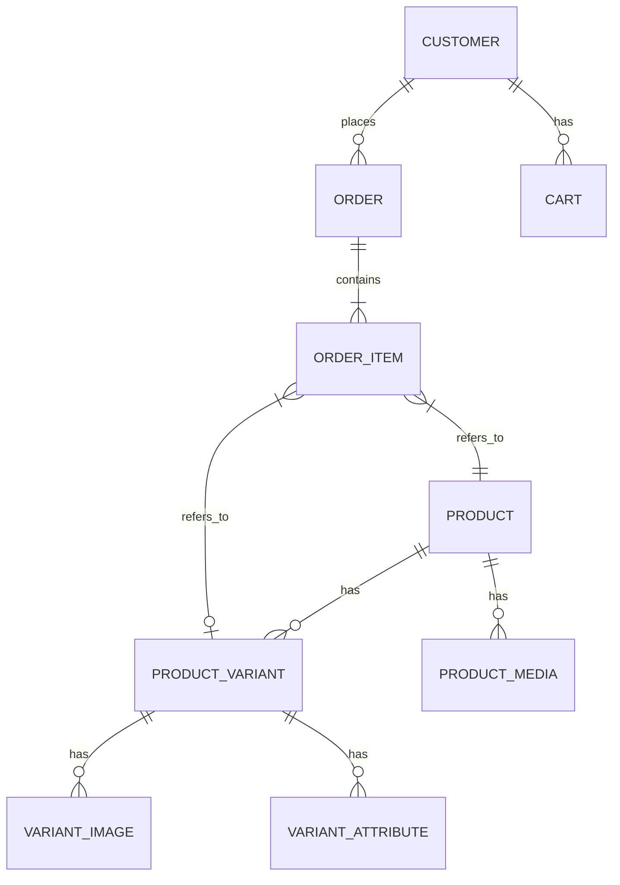

# Database Analysis

## 1. Database Overview
- **Database Engine:** PostgreSQL
- **ORM Used:** Prisma (`provider = "prisma-client-js"`)
- **Schema Location:** `nest_/prisma/schema.prisma`
- **Tables Count:** 70+

The database schema is highly relational, accommodating a complex e-commerce structure with support for premium watches, variants, loyalty programs, shipping, taxes, and granular user/admin roles.

## 2. Core Entities Analysis

### 2.1 Users & Authentication
- **User Models:** `User`, `Admin`, `Customer`
- **Security:** Incorporates `PasswordHistory`, `PersonalAccessToken`, and `PasswordResetToken`.
- **Sessions:** Tracked in `Session` table (contains `userId`, `ipAddress`, `userAgent`).
- **Audit Trails:** `ActivityLog` and `AuditTrail` maintain a detailed history of admin and customer actions.

### 2.2 Products & Catalog
- **Products (`products`):** Contains core product details (name, sku, price, stock, styling attributes like `bgColor`, `accentColor`, `gradient`).
- **Variants (`product_variants`):** Essential for a watch store (e.g., dial colors, bracelets). Has its own SKU, price, stock, and attributes.
- **Attributes & Specs:** Managed through `attributes`, `attribute_values`, `specifications`, `specification_groups`.
- **Categories & Brands:** Hierarchical category system (`categories`, `category_hierarchies`) and brands (`brands`).
- **Watch-Specific Entities:** Custom models for watch components like `Belt`, `Box`, and `ProductCareStep` indicate a premium watch customization focus.

### 2.3 Media & Images
- **Media (`media`):** Centralized storage for all files, with `mimeType`, `disk`, and metadata.
- **Relations:** 
  - `ProductMedia` and `VariantImage` link products/variants to their respective images.
  - Variant images support `isPrimary` flag and `type` (e.g., GALLERY).

### 2.4 E-Commerce Flow (Cart to Order)
- **Cart:** `carts` and `cart_items` store session-based or customer-based cart data.
- **Orders:** Comprehensive order management through `orders`, `order_items`, `order_addresses`, `order_status_history`.
- **Shipping & Taxes:** Complex shipping and tax calculations via `shipping_zones`, `shipping_methods`, `tax_classes`, `tax_rates`.
- **Inventory:** `warehouses`, `warehouse_stocks`, and `stock_history` for multi-location inventory management.

## 3. Entity-Relationship (ER) Insights

## 4. Potential Issues & Optimizations

### 4.1 Missing Indexes
While Prisma handles many foreign key indexes automatically due to explicit declarations, the following areas might need attention:
- `Product.sku` and `ProductVariant.sku` are unique (good), but `Product.status` and `ProductVariant.isActive` are indexed individually. Composite indexes on `(status, isFeatured)` could speed up catalog queries.
- `CartItem.sessionId` is missing in `CartItem` (it relies on `Cart` for session association). If querying cart items directly by session, a join is required.

### 4.2 Duplicate Data / Denormalization
- `sellingPrice`, `specialPrice` exist on both `Product` and `ProductVariant`. This requires synchronization logic when saving products to ensure the parent product reflects the correct variant prices.
- `Product` has an `images` string field, but there is also a `ProductMedia` relation. This dual-storage might cause synchronization bugs (where the string doesn't match the relation).

### 4.3 Database Architecture Risks
- **Variant Complexity:** A single watch might have combinations of Belts and Dials. The `combinationHash` in `ProductVariant` suggests a dynamic combination approach, which can lead to a combinatorial explosion of rows if not managed carefully.
- **Cart Abandonment:** The `carts` table could grow infinitely for unauthenticated sessions (`sessionId`). A cleanup cron job is necessary for rows where `status == "abandoned"` or `abandonedAt` is past a threshold.
