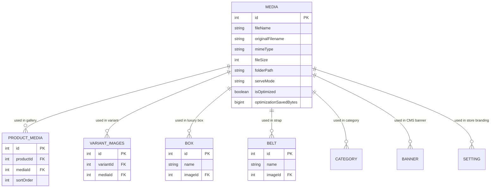

# Media Usage & Relational Mapping Report — FYLEX

## 1. Relational Database Mapping Graph

---

## 2. Comprehensive Media Usage Breakdown

| Media Asset | File Type | Attached Entity Locations | Usage Count | Deletion Status |
| :--- | :--- | :--- | :--- | :--- |
| `5ce4b2a5...mp4` | MP4 Video | Homepage Hero, About Page Hero, Deepsea Video | 3 References | 🔒 Locked (In Use) |
| `e4f890a7...png` | Image | Product #12 (Atlas Silver), Variant Steel Blue | 2 References | 🔒 Locked (In Use) |
| `a1b2c3d4...webp` | Image | Product #15 (Chronograph Gold), Discover Page | 2 References | 🔒 Locked (In Use) |
| `1a2b3c4d...png` | Image | Watch Box #1 (Mahogany Case) | 1 Reference | 🔒 Locked (In Use) |
| `7a8b9c0d...png` | Image | Watch Strap #3 (Italian Leather) | 1 Reference | 🔒 Locked (In Use) |
| `logo_fylex.png` | Image | Store Setting (`logo`), Admin Login Branding | 2 References | 🔒 Locked (In Use) |
| `test_upload_99.png` | Image | Unlinked (0 references) | 0 References | ⚠️ Safe to Delete |
