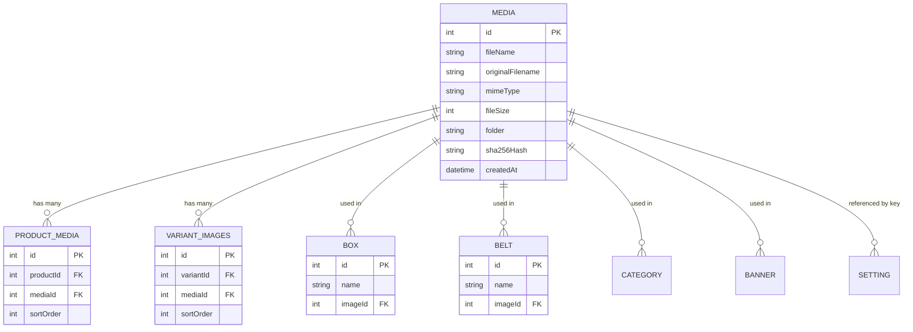

# Media Usage Map — Entity & Asset Dependency Matrix

## 1. Relational Database Mapping

The single source of truth for digital assets is the `media` table in PostgreSQL. Below is the full relational database schema mapping media assets to domain entities.

---

## 2. Media Usage Matrix by Module

| Entity / Module | Database Field / FK | Reference Type | Canonical Storage Format | Example Asset Path |
| :--- | :--- | :--- | :--- | :--- |
| **Products (Gallery)** | `product_media.mediaId` | FK (`media.id`) | Relational FK | `/uploads/e4f890a7...png` |
| **Product Variants (Hero)** | `product_variant.heroImageId` | FK (`media.id`) | Relational FK | `/uploads/a1b2c3d4...webp` |
| **Product Variants (Background)** | `product_variant.heroBgImageId` | FK (`media.id`) | Relational FK | `/uploads/f5e6d7c8...webp` |
| **Watch Boxes** | `box.imageId` | FK (`media.id`) | Relational FK | `/uploads/1a2b3c4d...png` |
| **Watch Belts / Straps** | `belt.imageId` | FK (`media.id`) | Relational FK | `/uploads/7a8b9c0d...png` |
| **Categories** | `category.image` | String / URL | File Path String | `/uploads/b9c8d7e6...png` |
| **Banners (Section 2 & 3)** | `banner.image` | String / URL | File Path String | `/uploads/5a6b7c8d...png` |
| **Homepage Hero Video** | `setting.key = 'home_hero_video'` | System Setting | File Path String | `/uploads/5ce4b2a5...mp4` |
| **Homepage Legacy Video** | `setting.key = 'home_legacy_video'` | System Setting | File Path String | `/uploads/5ce4b2a5...mp4` |
| **About Hero Video** | `setting.key = 'shop_hero_video'` | System Setting | File Path String | `/uploads/884d7106...mp4` |
| **About Deep Sea Video** | `setting.key = 'shop_deepsea_video'` | System Setting | File Path String | `/uploads/facd4044...mp4` |
| **Store Logo** | `setting.key = 'logo'` | System Setting | File Path String | `/uploads/logo_fylex.png` |
| **Store Favicon** | `setting.key = 'favicon'` | System Setting | File Path String | `/uploads/favicon.png` |
| **Community Wristshots** | `community_image.image` | String / URL | File Path String | `/uploads/user_shot_01.jpg` |
| **Watch Care Steps** | `product_care_step.imageUrl` | String / URL | File Path String | `/uploads/care_clean.png` |
